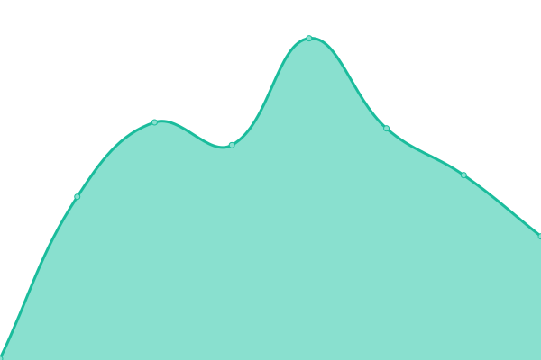
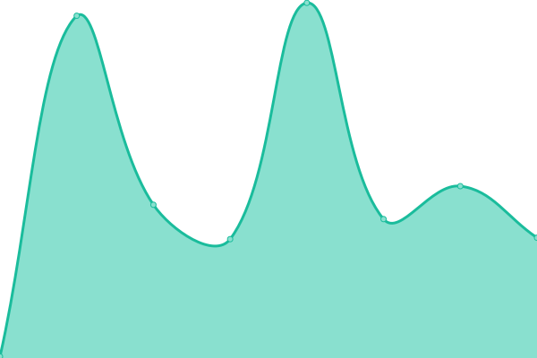

# [📈 Live Status](https://status.vikshan.me): <!--live status--> **🟩 All systems operational**

This repository contains the open-source uptime monitor and status page for [Vikshan](ko-fi.com/vixshan), powered by [Upptime](https://github.com/upptime/upptime).

With [Upptime](https://upptime.js.org), you can get your own unlimited and free uptime monitor and status page, powered entirely by a GitHub repository. We use [Issues](https://github.com/vixshan/upptime/issues) as incident reports, [Actions](https://github.com/vixshan/upptime/actions) as uptime monitors, and [Pages](https://status.vikshan.me) for the status page.

<!--start: status pages-->
<!-- This summary is generated by Upptime (https://github.com/upptime/upptime) -->
<!-- Do not edit this manually, your changes will be overwritten -->
<!-- prettier-ignore -->
| URL | Status | History | Response Time | Uptime |
| --- | ------ | ------- | ------------- | ------ |
|  [Mochi](https://mochidb-3d5ad3c56585.herokuapp.com) | 🟩 Up | [mochi.yml](https://github.com/vixshan/upptime/commits/HEAD/history/mochi.yml) | 

 666ms
     
 | 

<a href="https://status.vikshan.me/history/mochi">44.54%</a>
    

|  [Mochi Docs](https://docs.vikshan.me) | 🟩 Up | [mochi-docs.yml](https://github.com/vixshan/upptime/commits/HEAD/history/mochi-docs.yml) | 

 558ms
     
 | 

<a href="https://status.vikshan.me/history/mochi-docs">100.00%</a>
    

|  [Mimo](mimo.vikshan.me) | 🟩 Up | [mimo.yml](https://github.com/vixshan/upptime/commits/HEAD/history/mimo.yml) | 

 142ms
     
 | 

<a href="https://status.vikshan.me/history/mimo">100.00%</a>
    

|  [Server Website](server.vikshan.me) | 🟩 Up | [server-website.yml](https://github.com/vixshan/upptime/commits/HEAD/history/server-website.yml) | 

 132ms
     
 | 

<a href="https://status.vikshan.me/history/server-website">100.00%</a>
    

|  [Discord](https://discord.com) | 🟩 Up | [discord.yml](https://github.com/vixshan/upptime/commits/HEAD/history/discord.yml) | 

 50ms
     
 | 

<a href="https://status.vikshan.me/history/discord">100.00%</a>
    

<!--end: status pages-->

[**Visit our status website →**](https://status.vikshan.me)

## 📄 License

- Powered by: [Upptime](https://github.com/upptime/upptime)
- Code: [MIT](./LICENSE) © [Vikshan](ko-fi.com/vixshan)
- Data in the `./history` directory: [Open Database License](https://opendatacommons.org/licenses/odbl/1-0/)
