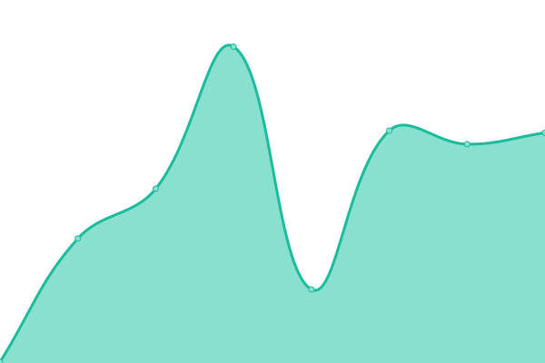

# [📈 Live Status](https://status.vikshan.tech): <!--live status--> **🟧 Partial outage**

This repository contains the open-source uptime monitor and status page for [Vikshan](ko-fi.com/vixshan).

We use [Issues](https://github.com/vixshan/upptime/issues) as incident reports, [Actions](https://github.com/vixshan/upptime/actions) as uptime monitors, and [Pages](https://status.vikshan.tech) for the status page.

<!--start: status pages-->
<!-- This summary is generated by Upptime (https://github.com/upptime/upptime) -->
<!-- Do not edit this manually, your changes will be overwritten -->
<!-- prettier-ignore -->
| URL | Status | History | Response Time | Uptime |
| --- | ------ | ------- | ------------- | ------ |
|  [Vikshan](https://vikshan.tech) | 🟩 Up | [vikshan.yml](https://github.com/iamvikshan/upptime/commits/HEAD/history/vikshan.yml) | 

 1926ms
     
 | 

<a href="https://status.vikshan.tech/history/vikshan">99.39%</a>
    

|  [Amina Docs](https://docs.vikshan.tech) | 🟥 Down | [amina-docs.yml](https://github.com/iamvikshan/upptime/commits/HEAD/history/amina-docs.yml) | 

 163ms
     
 | 

<a href="https://status.vikshan.tech/history/amina-docs">61.73%</a>
    

|  [utopia](utopia.pylex.xyz) | 🟩 Up | [utopia.yml](https://github.com/iamvikshan/upptime/commits/HEAD/history/utopia.yml) | 

 206ms
     
 | 

<a href="https://status.vikshan.tech/history/utopia">97.65%</a>
    

|  [Short Url Service](https://go.vikshan.tech) | 🟥 Down | [short-url-service.yml](https://github.com/iamvikshan/upptime/commits/HEAD/history/short-url-service.yml) | 

 465ms
     
 | 

<a href="https://status.vikshan.tech/history/short-url-service">61.73%</a>
    

|  [ViKSHaN Server Website](https://server.vikshan.tech) | 🟥 Down | [vi-ks-ha-n-server-website.yml](https://github.com/iamvikshan/upptime/commits/HEAD/history/vi-ks-ha-n-server-website.yml) | 

 91ms
     
 | 

<a href="https://status.vikshan.tech/history/vi-ks-ha-n-server-website">61.73%</a>
    

|  [Dub.co slug](https://l.vikshan.tech/) | 🟥 Down | [dub-co-slug.yml](https://github.com/iamvikshan/upptime/commits/HEAD/history/dub-co-slug.yml) | 

 819ms
     
 | 

<a href="https://status.vikshan.tech/history/dub-co-slug">61.73%</a>
    

<!--end: status pages-->

[**Visit our status website →**](https://status.vikshan.tech)

## 📄 License

- Powered by: [Upptime](https://github.com/upptime/upptime)
- Code: [MIT](./LICENSE) © [Vikshan](ko-fi.com/vixshan)
- Data in the `./history` directory: [Open Database License](https://opendatacommons.org/licenses/odbl/1-0/)

