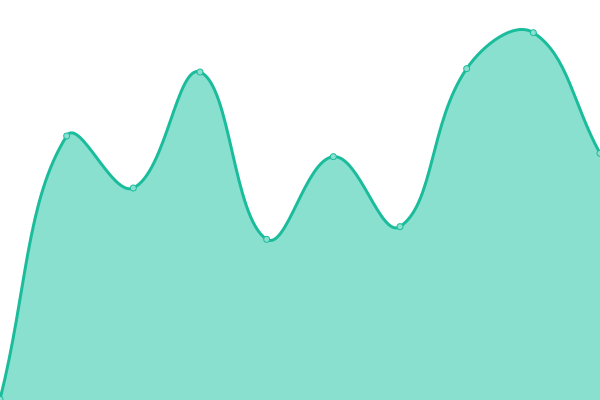

<!-- @format -->

# [📈 Live Status](https://status.vikshan.me): <!--live status--> **🟩 All systems operational**

This repository contains the open-source uptime monitor and status page for [Vikshan](ko-fi.com/vixshan).

We use [Issues](https://github.com/vixshan/upptime/issues) as incident reports, [Actions](https://github.com/vixshan/upptime/actions) as uptime monitors, and [Pages](https://status.vikshan.me) for the status page.

<!--start: status pages-->
<!-- This summary is generated by Upptime (https://github.com/upptime/upptime) -->
<!-- Do not edit this manually, your changes will be overwritten -->
<!-- prettier-ignore -->
| URL | Status | History | Response Time | Uptime |
| --- | ------ | ------- | ------------- | ------ |
|  [Vikshan](https://vikshan.me) | 🟩 Up | [vikshan.yml](https://github.com/iamvikshan/upptime/commits/HEAD/history/vikshan.yml) | 

 273ms
     
 | 

<a href="https://up.vikshan.me/history/vikshan">100.00%</a>
    

|  [Vix Pix](https://pixels.vikshan.me/) | 🟩 Up | [vix-pix.yml](https://github.com/iamvikshan/upptime/commits/HEAD/history/vix-pix.yml) | 

 231ms
     
 | 

<a href="https://up.vikshan.me/history/vix-pix">100.00%</a>
    

|  [Instatus Status Page](https://mina.instatus.com) | 🟩 Up | [instatus-status-page.yml](https://github.com/iamvikshan/upptime/commits/HEAD/history/instatus-status-page.yml) | 

 436ms
     
 | 

<a href="https://up.vikshan.me/history/instatus-status-page">99.83%</a>
    

|  [Short Url Service](https://go.vikshan.me) | 🟩 Up | [short-url-service.yml](https://github.com/iamvikshan/upptime/commits/HEAD/history/short-url-service.yml) | 

 486ms
     
 | 

<a href="https://up.vikshan.me/history/short-url-service">100.00%</a>
    

<!--end: status pages-->

[**Visit our status website →**](https://status.vikshan.me)

## 📄 License

- Powered by: [Upptime](https://github.com/upptime/upptime)
- Code: [MIT](./LICENSE) © [Vikshan](ko-fi.com/vixshan)
- Data in the `./history` directory: [Open Database License](https://opendatacommons.org/licenses/odbl/1-0/)

